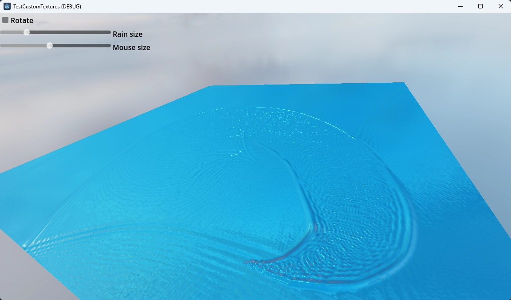

# Compute texture

This demo shows how to use compute shaders to populate a texture that is used as an input for a material shader.

When the mouse cursor isn't hovering above the plane random "drops" of water are added that drive the ripple effect.
When the mouse cursor is above the plane you can "draw" on the plane to drive the ripple effect.

Language: GDScript

Renderer: Forward+

> Note: this demo requires Godot 4.2 or later

## Screenshots

## Technical description

The texture populated by the compute shader contains height data that is used in the material shader to create a rain drops/water ripple effect. It's a well known technique that has been around since the mid 90ies, adapted to a compute shader.

Three textures are created directly on the rendering device:
- One texture is used to write the heightmap to and used in the material shader.
- One texture is read from and contains the previous frames data.
- One texture is read from and contains data from the frame before that.

Instead of copying data from texture to texture to create this history, we simply cycle the RIDs.

Note that in this demo we are using the main rendering device to ensure we execute our compute shader before our normal rendering.

To use the texture with the latest height data we use a `Texture2DRD` resource, this is a special texture resource node that is able to use a texture directly created on the rendering device and expose it to material shaders.

The material shader uses a standard gradient approach by sampling the height map and calculating tangent and bi-normal vectors and adjust the normal accordingly.

## Licenses

Files in the `polyhaven/` folder are downloaded from <https://polyhaven.com/a/industrial_sunset_puresky>
and are licensed under CC0 1.0 Universal.
